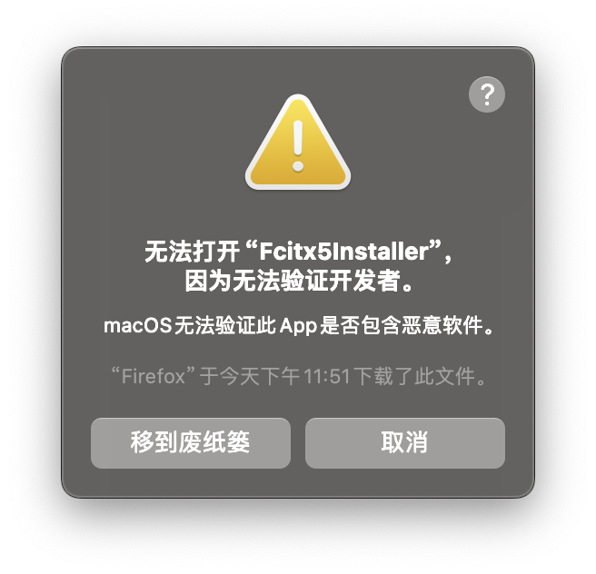
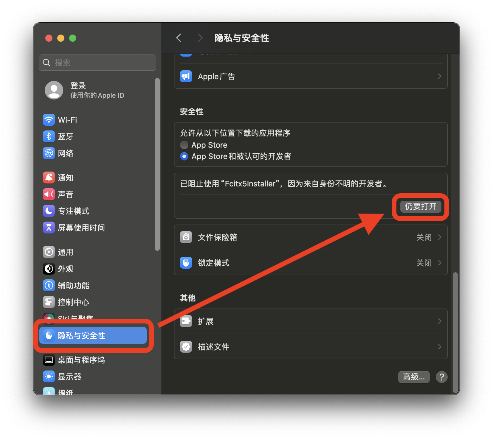

[English](README.md)
|
中文

# 小企鹅输入法 macOS 版安装器

支持 macOS >= 13

请选择适合您的安装包：
* [拼音版](https://github.com/fcitx-contrib/fcitx5-macos-installer/releases/download/latest/Fcitx5-Pinyin.zip)（可选双拼、五笔、仓颉等，中、英切换快捷键为 Ctrl + 左 Shift）
* [中州韵版](https://github.com/fcitx-contrib/fcitx5-macos-installer/releases/download/latest/Fcitx5-Rime.zip)（适合鼠须管用户）
* [原装版](https://github.com/fcitx-contrib/fcitx5-macos-installer/releases/download/latest/Fcitx5Installer.zip)（不适合新手，通过内置的插件管理器按需安装输入法）

安装包本身适用于 Intel 和 Apple Silicon，
但会根据您的机器类型，
安装单一架构的输入法，
减少不必要的空间占用。

当您解压并打开安装程序时，系统可能阻止您打开未认证的程序。


请您理解，认证需要开发者付出免费软件无法接受的 **订阅** 成本。请您按下述步骤[手动解锁](#手动解锁)，或者使用[一键安装](#一键安装)命令。

感谢您使用小企鹅输入法。

## 手动解锁
系统设置 -> 隐私与安全性 -> 仍要打开



## 一键安装
复制您选择的安装包的相应命令，打开系统的 **终端** 应用程序，粘贴并回车。

请确认复制完整，命令以`Fcitx5Installer.app`结尾。

### 拼音版
```sh
cd /tmp && rm -rf Fcitx5Installer.app && curl -LO https://github.com/fcitx-contrib/fcitx5-macos-installer/releases/download/latest/Fcitx5-Pinyin.zip && unzip Fcitx5-Pinyin.zip && open Fcitx5Installer.app
```

### 中州韵版
```sh
cd /tmp && rm -rf Fcitx5Installer.app && curl -LO https://github.com/fcitx-contrib/fcitx5-macos-installer/releases/download/latest/Fcitx5-Rime.zip && unzip Fcitx5-Rime.zip && open Fcitx5Installer.app
```

### 原装版
```sh
cd /tmp && rm -rf Fcitx5Installer.app && curl -LO https://github.com/fcitx-contrib/fcitx5-macos-installer/releases/download/latest/Fcitx5Installer.zip && unzip Fcitx5Installer.zip && open Fcitx5Installer.app
```
